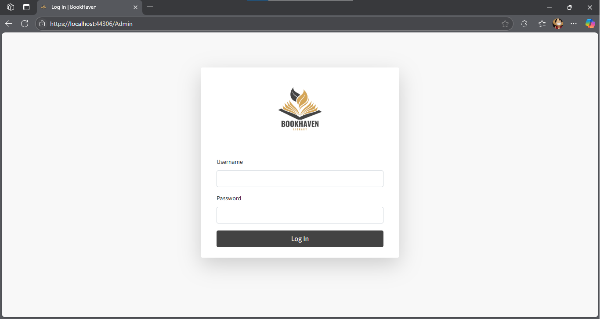
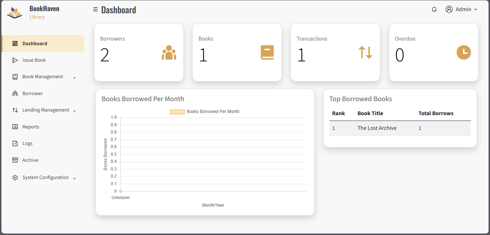
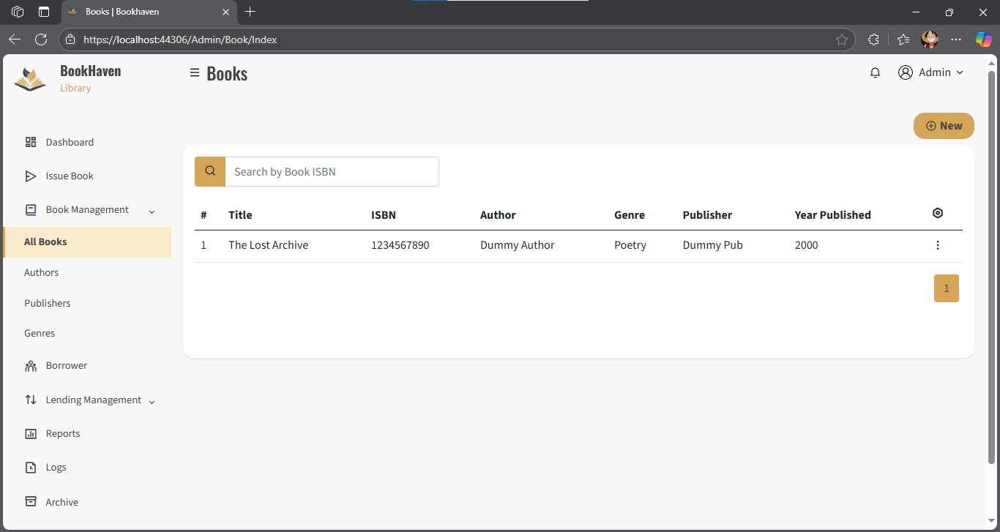
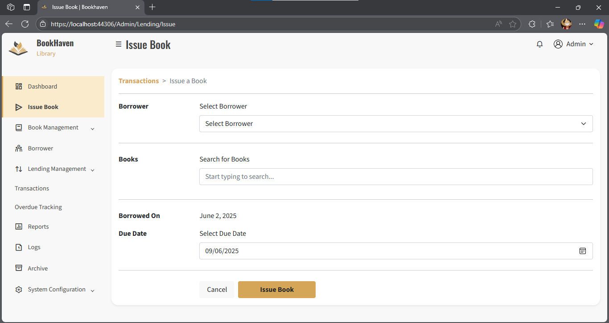
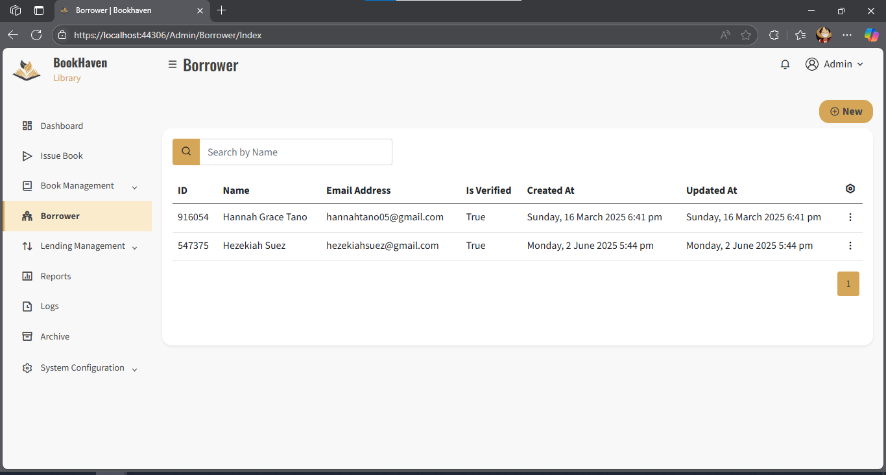
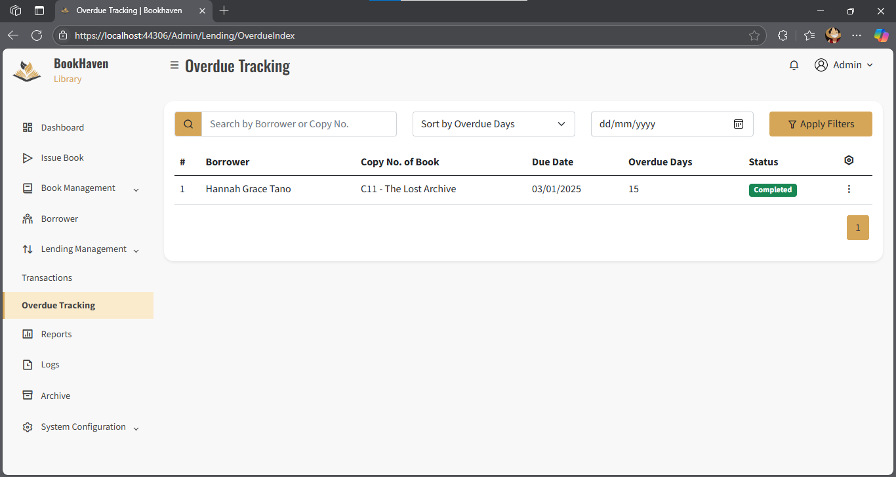
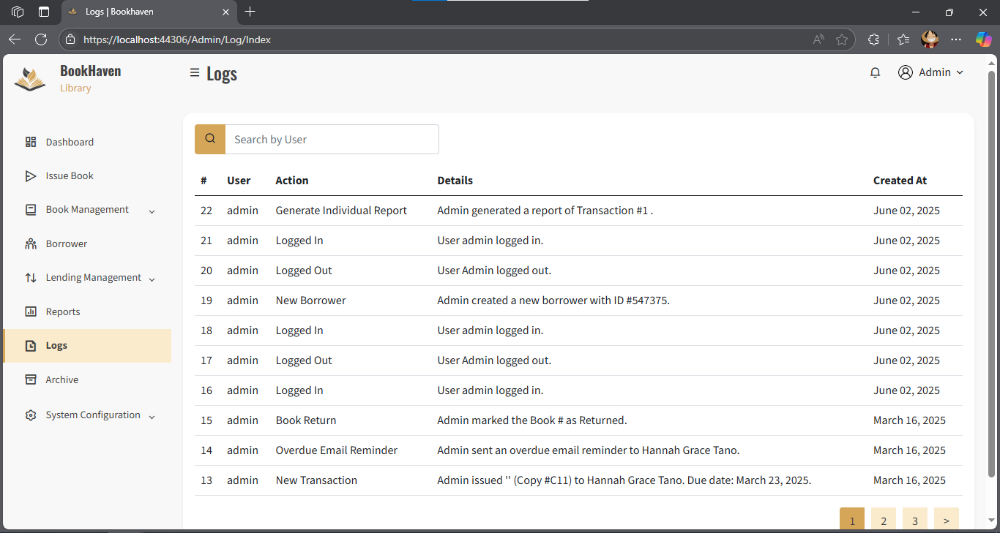
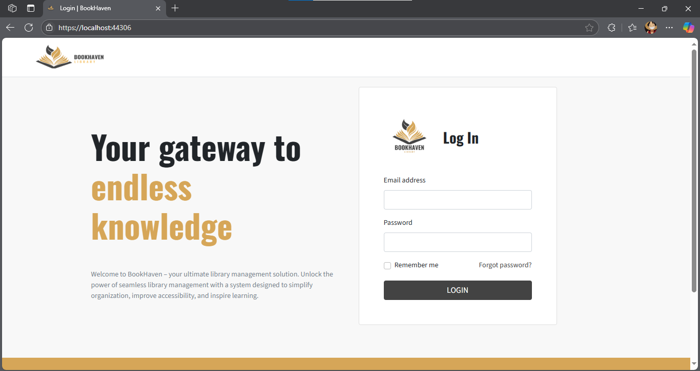
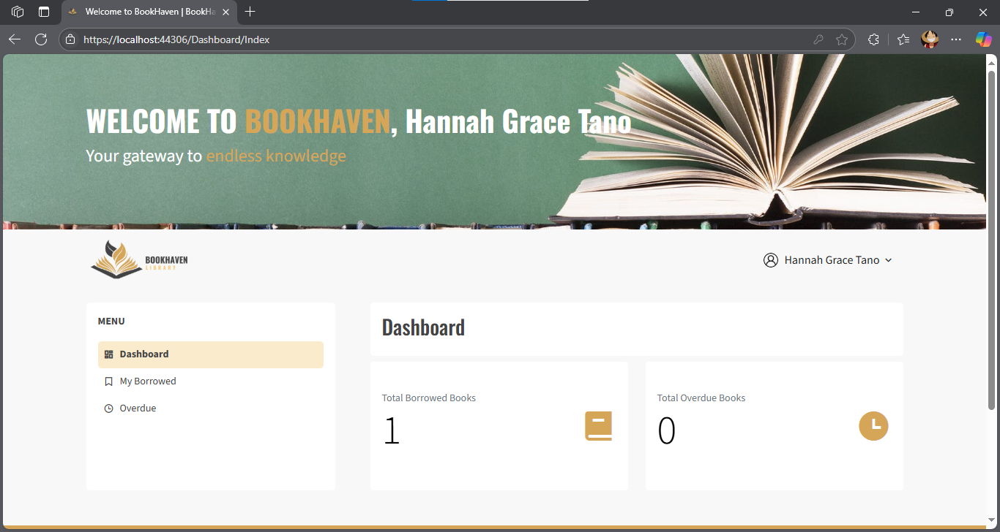
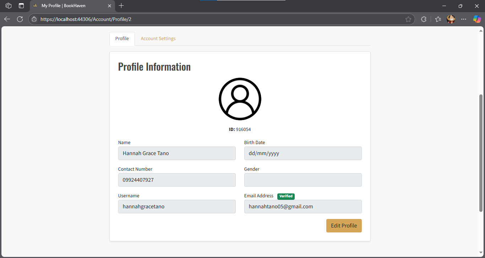

# Bookhaven - A Library Management System for Academic Institutions
BookHaven is a web-based application built with ASP.NET Core, designed to help academic institutions efficiently manage their physical book lending systems. It streamlines the process of borrowing books, tracking return dates, and managing library inventories, all within a user-friendly interface.

## 🚀 Features
- **Role-Based Access**: Support for Admins and Students (or general users).  
- **Book Inventory Management**: Add, update, and organize physical books by category, author, or subject.  
- **Borrowing System**: Users can borrow books and track due dates, helping avoid overdue returns.  
- **Email Notifications via SMTP**: Sends email confirmations or alerts to users (e.g., borrowing confirmations, reminders).
- **Monthly Transaction Reports**: Admins can generate reports summarizing all borrowing and returning transactions per month.  
- **Secure Authentication**: Custom login system for students and staff.  
- **Responsive Design**: Accessible on both desktop and mobile devices.  

## 🛠️ Tech Stack
- **Frontend:** Razor Pages / Blazor / HTML, CSS, Bootstrap
- **Backend:** ASP.NET Core
- **Database:** SQL Server / Entity Framework Core
- **Authentication:** Custom user management

## 📸 Screenshots
Here are some of the screenshots showcasing the BookHaven user interface.  
All images are stored in the `assets/` directory of this project.  

---  

## Admin's End  
### Login

### Dashboard

### Book List

### Issue Book

### Transactions

### Overdue Tracking

### Logs

---  

## User's End  
### Login

### Dashboard

### Borrower Profile

Developed by Hannah Grace Tano  
📧 h.tano.525338@umindanao.edu.ph  
📍 University of Mindanao – College of Computing Education
